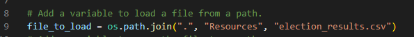

# An Analysis of Election Data Using Python
## Overview

The purpose of this analysis was to calculate election results derived from an excel spreadsheet that contains raw election data for a precinct with information for each ballot cast, including the county where each ballot was cast and the candidate each ballot was cast for.

A python script was made which calculated the total number of votes cast, the total number of votes for each candidate, the percentage of votes for each candidate, and the winner of the election based on the popular vote.

The number of votes cast from each county, the percentage of votes from each county and a calculation of the largest county turnout was also reported.

This was in turn printed out to a text file with a readout of results.

## Election-Audit Results

The following are the results of the audit:

- There were 369,711 total votes cast in the election:

- The following shows the number of votes cast in each county and the percentage of total votes for each county:

- The results show that Denver County was the county with the largest number of votes:

- The following shows a breakdown of the number of votes and the percentage of the total votes each candidate received:

- Finally, the below shows that Diana DeGette won the election with the corresponding vote count and winning percentage:

## Election-Audit Summary

This script could potentially be used for future elections as well.

Especially if the same type of information is wanting to be counted (county and candidate information listed directly from the individual ballots), the information could be inputted in the same format on any excel sheet and then ran using the code. If the excel sheet used was saved under a different name or folder, the code would only have to be changed to reflect the correct name and path of the spreadsheet in the file_to_load line. 

Otherwise, given the same type of information inputted in the columns, the code would work the same.

The code could also be modified to provide additional information to help plan future elections. For example, if the polling sites are also included for each vote cast in the same spreadsheet, the county variables and calculations could be duplicated, and with the variables changed in the duplicated code to pick up the information in the polling place column, the code could record and calculate the number of votes cast and calculate percentages for each polling place. This could help make sure that election workers are properly dispersed in future elections.
