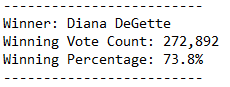

# An Analysis of Election Data Using Python
## Overview

The purpose of this analysis was to calculate election results from an excel spreadsheet that contains raw election data for a precinct with information for each ballot cast, including the county where each ballot was cast and the candidate each ballot was cast for.

A python script was made which calculated the total number of votes cast, the total number of votes for each candidate, the percentage of votes for each candidate, and the winner of the election based on the popular vote.

The number of votes cast from each county, the percentage of votes from each county and a calcuation of the largest county turnout was also reported.

This was in turn printed out to a text file with a readout of results.

## Election-Audit Results

The following are the results of the audit:

-There were 369,711 total votes cast in the election

-The following shows the number of votes cast in each county and the percentage of total votes for each county:

-The results show that Denver County was the county with the largest number of votes.

-The following shows a breakdown of the number of votes and the percentage of the total votes each candidate recieved.

-Finally, the below shows that Diana DeGette won the election with the corresponding vote count and winning percentage.

